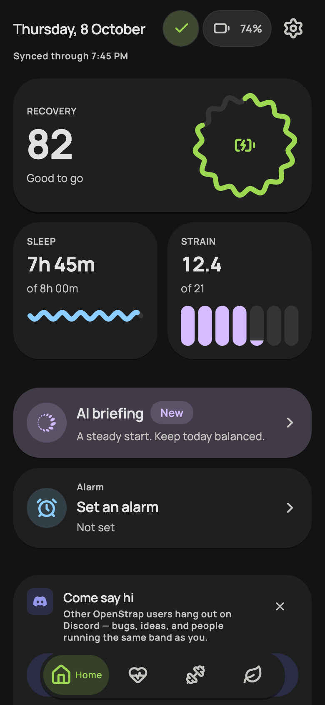
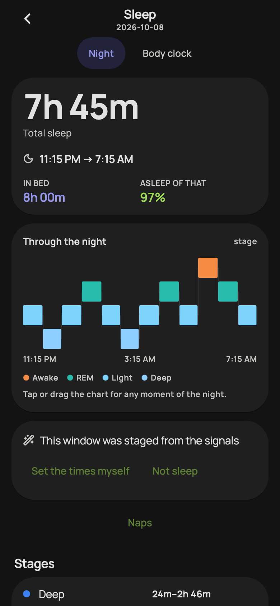
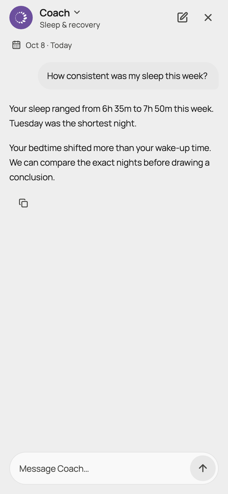

# Edge M3

A personal Android fork of [OpenStrap Edge](https://github.com/OpenStrap/edge), with a Material 3 Expressive interface. Band recordings and analytics stay on your phone. AI Coach uses your chosen provider only when configured.

## Screens

| Home | Sleep | Coach |
|:--:|:--:|:--:|
|  |  |  |

Rendered from the app with sample data. No personal recordings are shown.

## What's different

Floating navigation, expanding metric cards, selectable charts and theme palettes. Home includes band sync, battery, alarms and an optional AI briefing. Coach has saved chats and optional personalization. Italian is available alongside the existing languages.

Sleep planning uses observed history and labelled estimates; it does not establish biological sleep need or reproduce WHOOP's proprietary scoring. See [sleep-planning methods](https://github.com/MatteoFari/analytics/blob/62e1b999e44af203a79c600dbdfa8ce9943219d1/ALGORITHMS.md).

## Build

Use Flutter **3.41.6**. Sibling packages are pinned to full Git commits; keep local dependency overrides out of release validation.

```sh
flutter pub get
bash .github/scripts/check_sibling_pins.sh
flutter analyze
flutter test --concurrency=1
flutter build apk --release
```

APK: `build/app/outputs/flutter-apk/app-release.apk`. Updating an existing installation requires its package ID and signing key. Take a backup before switching builds; separate installations do not share data automatically.

Upstream documentation: [contributing](CONTRIBUTING.md), [confidence and measurement limits](CONFIDENCE.md), [security](SECURITY.md). This fork is not an official OpenStrap release and is not affiliated with WHOOP.

[MIT license](LICENSE). Credit to the OpenStrap contributors and the [protocol](https://github.com/OpenStrap/protocol) and [analytics](https://github.com/OpenStrap/analytics) projects.
